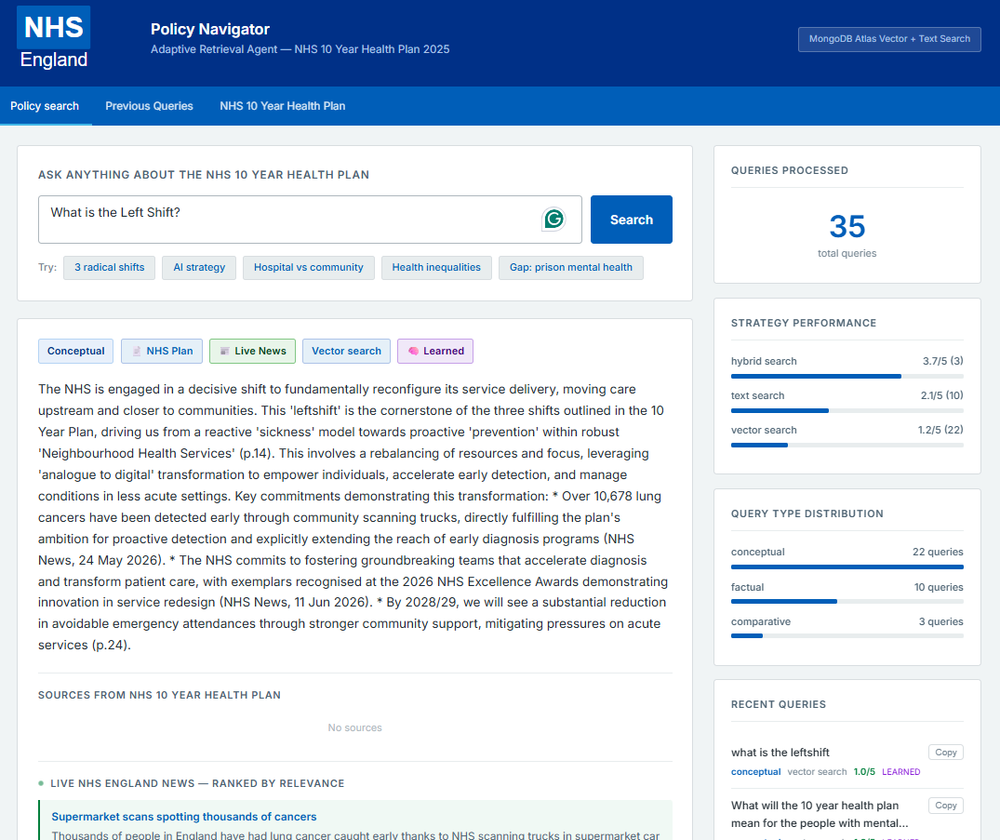

[](https://github.com/GIScience/badges#experimental)
[](https://github.com/chaeyoonyunakim/nhs-policy-navigator/actions/workflows/ci.yml)
[](https://nhsdigital.github.io/rap-community-of-practice/introduction_to_RAP/levels_of_RAP/)
[](https://github.com/psf/black)


# NHS Policy Navigator — Adaptive Multi-Source Retrieval Agent

> PoC built for the **MongoDB Agentic Evolution Hackathon** (London, May 2026)  
> Theme: **Adaptive Retrieval** — an agentic system that actively modifies its query approach based on input and learns from past performance.

**Live demo:** [https://nhs-policy-navigator.vercel.app](https://nhs-policy-navigator.vercel.app)

---

## What it does

NHS Policy Navigator is an adaptive retrieval agent over the **NHS 10 Year Health Plan "Fit for the Future" (July 2025)** plus live NHS England updates. It doesn't just do RAG — it reasons about *how* to retrieve and *which sources* to use before it retrieves.



For every query, the agent:

1. **Classifies** the question into one of four types: `factual`, `conceptual`, `comparative`, or `gap_analysis`
2. **Routes to sources by type**:
   - `factual` -> NHS plan
   - `conceptual` / `comparative` -> NHS plan + live NHS news
   - `gap_analysis` -> NHS plan + live NHS news + post-July-2025 NHS publications
3. **Selects a retrieval strategy** based on type — keyword search, vector search, or hybrid — using MongoDB Atlas
4. **Re-ranks retrieved chunks** by query relevance before generation
5. **Checks historical performance** — after 5+ queries of the same type, the agent switches to whichever strategy has scored highest, adapting autonomously
6. **Generates a grounded answer** with source-aware citations (plan pages + live sources where relevant)
7. **Self-evaluates** result quality (1–5 score) and **logs everything back to MongoDB**, enabling future adaptation

The UI also surfaces live news/publication cards and shows strategy performance + query history from MongoDB, making adaptation visible in real time. A dedicated **Previous Queries** tab browses the full query history (paginated, 10 per page, filterable by care setting / professional group), and any past question — in the sidebar or that tab — can be copied for reuse.

A **Query Router** sits alongside this. On every query it tags the question with NHS-domain facets — a **care setting** (Acute, Ambulance, Community, Mental Health and Learning Disability, Primary Care, Primary Care – Wider Primary Care) and a **professional group** (Medical, Clinical non-medical, Dentistry) — using the same Gemini wrapper, multi-label so one query can appear under several domains. Near-identical questions (cosine ≥ 0.92 on the query embedding) are **deduplicated** into a single cluster with an "asked N×" counter and surfaced as a categorised **digest** on the main page (right-bottom) — the **top 10 most-asked** questions per category — with a care-setting ⇄ professional-group toggle and one-click re-run. The digest (`query_digest`, via `GET /api/digest`) is the curated, deduped highlights view; the Previous Queries tab remains the complete, append-only log.

---

## Tech stack

| Layer | Technology |
|---|---|
| Database | MongoDB Atlas M0 — Vector Search + Full-Text Search |
| Embeddings | Google `gemini-embedding-001` (768 dims) |
| LLM | Google `gemini-2.0-flash` (with fallback to `gemini-2.0-flash-lite`, `gemini-2.5-flash`) |
| Backend | Python / FastAPI |
| Frontend | Vanilla HTML/JS (single file) |

> **Runs at zero external cost.** The entire stack uses only free-tier services: MongoDB Atlas **M0** (free forever) and the Google Gemini **free tier** for both embeddings and generation. There are no paid dependencies — no observability platform and no text-to-speech provider — so the project can be handed over and run without procuring any additional tooling.

---

## Sources used

Primary corpus:
- **NHS 10 Year Health Plan for England — Fit for the Future (July 2025)**
- **Executive summary** of the same plan

Live/secondary sources (fetched at query time):
- **NHS England RSS feed** (`https://www.england.nhs.uk/feed/`) for recent news
- **NHS publications post 3 July 2025** (live RSS filter + curated seed publications)

Download both PDFs and place them in the project root before running ingestion:

- **Full plan** — available at [https://www.england.nhs.uk/long-term-plan/](https://www.england.nhs.uk/long-term-plan/)
- **Executive summary** — available at the same link above

The PDFs are not committed to this repository due to file size. The ingestion script (`ingest.py`) expects them named exactly:

```
fit-for-the-future-10-year-health-plan-for-england.pdf
fit-for-the-future-10-year-health-plan-for-england-executive-summary.pdf
```

---

## Setup

You need Python 3.10+ and a free [Google AI Studio API key](https://aistudio.google.com/apikey).

### 1. Clone and create a virtual environment

```bash
git clone https://github.com/chaeyoonyunakim/nhs-policy-navigator.git
cd nhs-policy-navigator

python -m venv .venv
source .venv/bin/activate          # Windows: .venv\Scripts\activate
```

### 2. Install dependencies

```bash
pip install -r requirements.txt          # runtime only
# or, for development (tests, linters, pre-commit hooks):
make install-dev
```

### 3. Configure environment

```bash
cp .env.example .env
```

Open `.env` and fill in your credentials:

```env
MONGODB_URI=mongodb+srv://<user>:<password>@<cluster>.mongodb.net/?retryWrites=true&w=majority
GOOGLE_API_KEY=AIza...
DB_NAME=agentic-evolution-hackathon
```

`GOOGLE_API_KEY` is free — no billing required. Obtain one at [aistudio.google.com](https://aistudio.google.com/apikey). Together with your MongoDB Atlas connection string, it is the only credential the app needs — there are no paid third-party services to configure.

### 4. Download PDFs

Download both PDFs from [https://www.england.nhs.uk/long-term-plan/](https://www.england.nhs.uk/long-term-plan/) and place them in the project root (see filenames above).

### 5. Restore the MongoDB data from the dump (recommended)

The repository includes a pre-built dump of all 586 embedded chunks (using `gemini-embedding-001`, 768 dims). This is the fastest way to get started — no PDF ingestion or embedding calls needed:

```bash
mongoimport --uri "$MONGODB_URI" --db agentic-evolution-hackathon \
  --collection nhs_chunks --file dump/nhs_chunks.json --jsonArray
```

Then create both Atlas Search indexes manually in the Atlas UI (see [MongoDB Atlas index configuration](#mongodb-atlas-index-configuration) below).

**Alternatively — ingest from scratch:**

```bash
make ingest        # or: python -m nhs_policy_navigator.pipeline.ingest
```

This chunks both PDFs, generates `gemini-embedding-001` embeddings (768 dims), loads all chunks into MongoDB Atlas, and creates both search indexes automatically. Takes ~5–10 minutes.

Wait for both indexes to show **READY** in Atlas UI → Cluster → Search Indexes before running the app.

Note: live news and publication sources are fetched at query time and do not require ingestion.

### 6. Run the app

```bash
make run        # or: python -m uvicorn nhs_policy_navigator.app:app --reload --app-dir src
```

Open [http://localhost:8000](http://localhost:8000)

---

## Deploying to Vercel

The app ships with a `vercel.json` and an `api/index.py` entry point, so it deploys directly to Vercel's Python serverless runtime.

### 1. Install Vercel CLI and log in

```bash
npm i -g vercel
vercel login
```

### 2. Set environment variables

Use `printf` (not `echo`) to avoid BOM encoding issues on Windows:

```bash
printf 'your-mongodb-uri' | vercel env add MONGODB_URI production
printf 'your-google-api-key' | vercel env add GOOGLE_API_KEY production
printf 'agentic-evolution-hackathon' | vercel env add DB_NAME production
```

Repeat for `preview` and `development` environments as needed.

### 3. Deploy

```bash
vercel --prod
```

### Notes

- MongoDB Atlas must allow connections from `0.0.0.0/0` (Network Access → Add IP Address) since Vercel serverless functions use dynamic IPs.
- The `StaticFiles` mount in `app.py` is skipped when `VERCEL=1` (set automatically by Vercel); static assets are served via `vercel.json` routes instead.
- After deploying, run `ingest.py` locally pointing at the same Atlas cluster to populate the database before querying.

---

## MongoDB Atlas index configuration

Two indexes are created automatically by `ingest.py`:

**Vector index** (`vector_index`, type: `vectorSearch`):
```json
{
  "fields": [{
    "type": "vector",
    "path": "embedding",
    "numDimensions": 768,
    "similarity": "cosine"
  }]
}
```

> ⚠️ `numDimensions` must be **768** to match `gemini-embedding-001`. Using 1536 (OpenAI) will cause vector search to return no results.

**Text search index** (`text_index`, type: `search`):
```json
{
  "mappings": {
    "dynamic": false,
    "fields": { "text": [{ "type": "string" }] }
  }
}
```

---

## Example queries

| Query | Classified as | Strategy |
|---|---|---|
| What are the NHS targets for GP access by 2028? | `factual` | Text search |
| What does the plan say about AI in the NHS? | `conceptual` | Vector search |
| How does hospital care compare to community care? | `comparative` | Hybrid search |
| Does the plan address mental health in prisons? | `gap_analysis` | Vector search |

For `conceptual`, `comparative`, and `gap_analysis`, results may include:
- Ranked **live NHS news** context from RSS
- Ranked **post-July-2025 NHS publications** context (for `gap_analysis`)

---

## Project structure

The code is packaged under `src/` following the
[NHS England "package your code"](https://github.com/nhsengland/package-your-code-workshop)
conventions.

```
├── src/nhs_policy_navigator/
│   ├── __init__.py        # Package version
│   ├── config.py          # Environment-driven settings (no hard-coded secrets)
│   ├── logging_config.py  # Structured logging setup
│   ├── gemini.py          # Gemini REST API wrapper (embed + generate, no SDK)
│   ├── agent.py           # Core multi-source adaptive retrieval logic
│   ├── router.py          # Query Router — facet tagging, dedup & digest
│   ├── app.py             # FastAPI backend (query, stats, queries, digest, health)
│   └── pipeline/
│       ├── ingest.py      # PDF ingestion + MongoDB index creation
│       ├── reembed.py     # Re-embed existing docs (e.g. after model change)
│       └── export_db.py   # Export MongoDB collections to JSON (backup)
├── tests/                 # pytest unit tests (external services mocked)
├── docs/                  # Architecture, user guide, RAP compliance
├── api/index.py           # Vercel serverless entry point
├── static/                # Frontend (single-file HTML/JS) + NHS logo assets
├── dump/                  # Pre-embedded chunks + query history snapshot
├── img/                   # Wireframes and design references
├── .github/workflows/     # CI/CD (ruff + black + pytest)
├── pyproject.toml         # Packaging + tool config (black, ruff, pytest)
├── Makefile               # Common developer tasks (make help)
├── requirements.txt       # Runtime dependencies
├── requirements-dev.txt   # Development dependencies
├── .pre-commit-config.yaml
├── .editorconfig
├── CHANGELOG.md
├── CONTRIBUTING.md
├── vercel.json            # Vercel deployment config (routing + Python build)
└── README.md
```

## Development

This project is structured to meet **Gold RAP** (see
[`docs/rap_compliance.md`](docs/rap_compliance.md)).

```bash
make install-dev   # install dev deps + pre-commit hooks
make format        # auto-format with ruff + black
make lint          # ruff + black --check
make test          # run the pytest suite
make coverage      # tests with a coverage report
make help          # list all targets
```

Continuous integration (GitHub Actions) runs lint and tests on every pull
request across Python 3.10–3.12. All changes are reviewed by a human before
merge.

---

## Answer generation style

Answers are generated to mirror the writing style of the NHS 10 Year Health Plan executive summary — authoritative, declarative, and dense with specific commitments, dates and figures. The system prompt explicitly references the plan's signature framing ("three shifts", "Neighbourhood Health Service", "decisive shift") and instructs the model to lead every response with a strong claim rather than a definition.

---

## Adaptive retrieval behavior

- **Classification**: `factual`, `conceptual`, `comparative`, `gap_analysis`
- **Strategy options**: `text_search`, `vector_search`, `hybrid_search`
- **Learning rule**: if a query type has >=5 historical runs, use the best average-scoring strategy for that type
- **Re-ordering**: plan chunks are re-ranked by an LLM relevance score (0-10)
- **Source routing**: sources are chosen before retrieval based on query type

## Observability

Observability is built in and requires no external platform. Every query is logged to the MongoDB `query_log` collection with its full decision trail:
- Query classification and source routing decision (plan/news/publications)
- Strategy selection (default vs. learned from data) and relevance/self-evaluation score
- Sources queried and counts of live news / publications fetched

The UI makes this visible in real time — strategy performance, query-type distribution, and the browsable **Previous Queries** history all read directly from MongoDB, so you can watch the agent adapt without any third-party tracing service.

---

## Design reference

Frontend styling follows the NHS England identity and data visualisation guidelines:

- **NHS Identity Guidelines (colours, logo, typography):** [england.nhs.uk/nhsidentity](https://www.england.nhs.uk/nhsidentity/identity-guidelines/colours/)
- **NHS England Data Viz Community of Practice:** [github.com/nhsengland/data-viz-community-of-practice](https://github.com/nhsengland/data-viz-community-of-practice)
- **NHS digital service manual:** [service-manual.nhs.uk](https://service-manual.nhs.uk/design-system/styles/colour)

NHS colour palette used:

| Name | Hex |
|---|---|
| NHS Dark Blue | `#003087` |
| NHS Blue | `#005EB8` |
| NHS Mid Blue | `#0072CE` |
| NHS Light Blue | `#41B6E6` |
| NHS Aqua Blue | `#00A9CE` |
| NHS Green | `#007f3b` |

---

## Reproducible Analytical Pipeline (RAP)

This repository is organised to meet **Gold RAP** under the
[NHS RAP Community of Practice maturity framework](https://nhsdigital.github.io/rap-community-of-practice/introduction_to_RAP/levels_of_RAP/),
and draws on the
[NHS England repository template](https://github.com/nhs-england-tools/repository-template)
and the [NHS England "package your code" workshop](https://github.com/nhsengland/package-your-code-workshop).

A full criterion-by-criterion mapping is in
[`docs/rap_compliance.md`](docs/rap_compliance.md): packaged code, environment
configuration, structured logging, a unit test suite, CI/CD, a changelog and
semantic versioning.

## Documentation

- [Architecture](docs/architecture.md)
- [User guide](docs/user_guide.md)
- [RAP compliance](docs/rap_compliance.md)
- [Contributing](CONTRIBUTING.md)
- [Changelog](CHANGELOG.md)

## Licence

MIT — see [LICENSE](./LICENSE).
